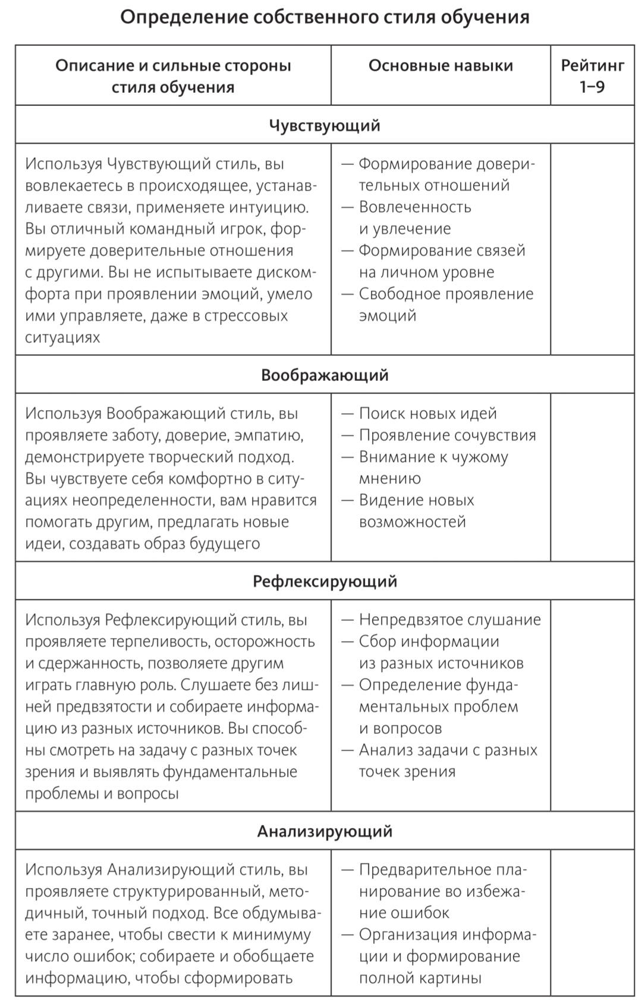
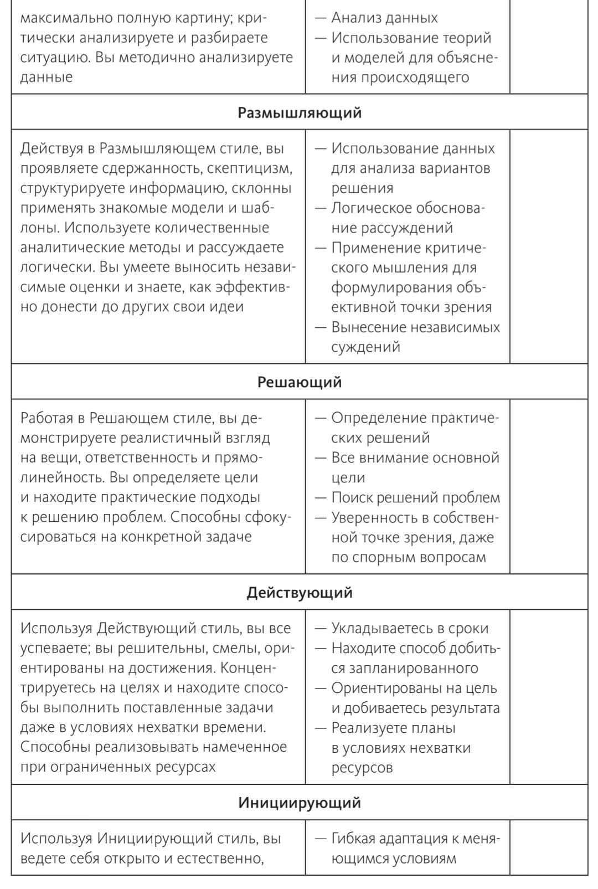
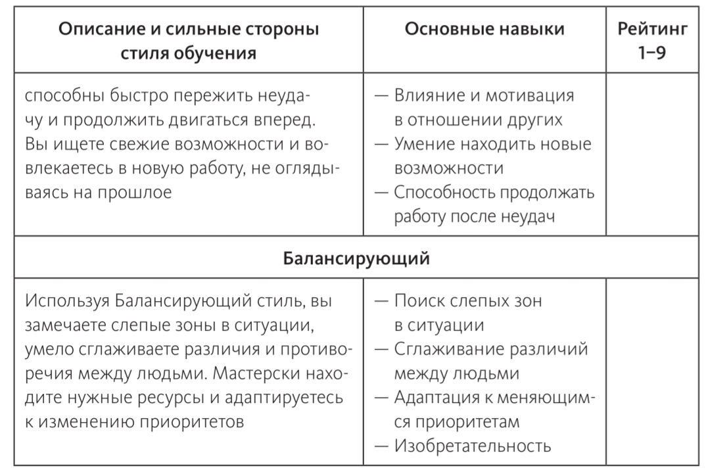

# ГЛАВА 3
# МОЙ СТИЛЬ ОБУЧЕНИЯ, МОЯ ЖИЗНЬ
1. СТИЛЬ ОБУЧЕНИЯ: КАК ВЫ ИСПОЛЬЗУЕТЕ ЦИКЛ ПОЗНАНИЯ

Стилей обучения всего 9. Они в каких-то местах могут пересекаться по описанию. У человека может быть одновременно несколько стилей. Некоторые из них мы используем и они нам нравятся другие используем реже, временами, а от некоторых стилей мы держимся подальше и не применяем их.

---
>Есть внутренняя энергия, жизненная сила, оживление и ускорение, которые выплескиваются в ваши действия, и, поскольку другого такого, как вы, не существует, это выражение уникально. Если вы его блокируете, оно никогда не сможет транслироваться через другого посредника и утратится навсегда. @Марта Грэм

В этой главе мы исследуем ваш уникальный стиль обучения
и его влияние на ваш жизненный путь. Вы узнаете, что
существует девять разных подходов к обучению, каждый
из которых имеет и сильные стороны, и недостатки, в силу
чего они приводят к разным результатам. Наверняка вы
заметите, что какие-то из этих способов кажутся вам более
знакомыми, а другие напоминают поведение коллег или дру-
зей. Узнав, каков ваш привычный стиль обучения, вы сможете
лучше оценить собственные сильные и слабые стороны
и понять причины принимаемых вами решений. Умение
различать эти стили помогает выявлять и проблемы между
собеседниками, которые смотрят на вещи совершенно иначе.
Разобравшись, чем они отличаются, вы сможете строить
более прочные отношения в рамках организации, в команде
и в семье, потому что поймете, как ваши слабые стороны
могут компенсироваться чьими-то сильными качествами,
и наоборот. Вы также увидите сильные стороны методов
обучения, отличных от вашего, и сможете расширить свои
возможности. Все девять стилей в совокупности полностью
описывают потенциал каждого человека: любой из четырех
этапов цикла познания неотделим от всего процесса, а стили
можно считать отражениями сторон личности. В совокупно-
сти они открывают доступ к достаточно широким возмож-
ностям, чтобы успешно находить выход из любой ситуации
и продолжать учиться на опыте.

## СТИЛЬ ОБУЧЕНИЯ: КАК ВЫ ИСПОЛЬЗУЕТЕ ЦИКЛ ПОЗНАНИЯ

